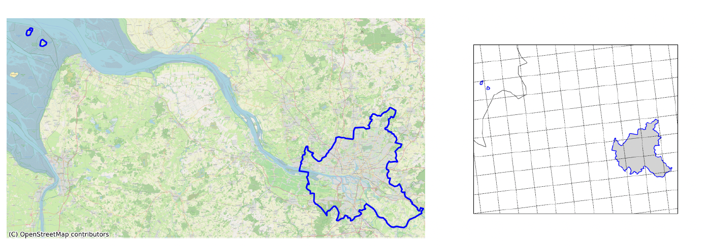

Die kreisfreie Stadt Hamburg gehört mit einer Fläche von ca. 753 km² zu den Regionen, die von den Klimamodellen, die mit einer Gitterauflösung von ca. 12,5 km x 12,5 km vorliegen, aufgelöst werden können. Der Wert der klimatischen Kennwerte berechnet sich aus der anteilsgewichteten Mittelung aller Modellgitterboxen, die ganz oder anteilig in der Region liegen.

## Zitierhinweis:
<small>Pfeifer, S., Bülow, K., & Rechid, D. (2026). GERICS Klimaausblick Hamburg Version 1.1, Climate Service Center Germany (GERICS), eine Einrichtung der Helmholtz-Zentrum Hereon GmbH.10.5281/zenodo.21475095.</small>