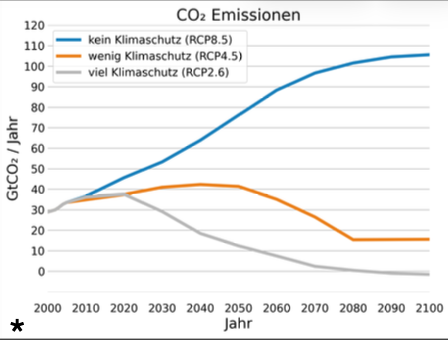

# Klimaprojektionen und Szenarien 

* Quelle: http://www.pik-potsdam.de/~mmalte/rcps/index.htm#Download

Mit Klimamodellen können Projektionen für das zukünftige Klima berechnet werden. Diese liefern Antworten auf die Frage: „Was wäre, wenn?“ Verschiedene Annahmen, z. B. zur Bevölkerungsentwicklung, der Energiegewinnung und -nutzung, dem technologischen Fortschritt oder der Wirtschaftsleistung, führen zu verschiedenen Entwicklungspfaden von Emissionen und Konzentrationen an Treibhausgasen. Solche Szenarien sind keine Vorhersagen, sondern beschreiben verschiedene plausible Entwicklungen. Mit Klimamodellen werden dann die Auswirkungen der Emissionen und der damit verbundenen veränderten Zusammensetzung der Atmosphäre auf das Klimasystem der Erde simuliert.

Im Rahmen des fünften [IPCC-Sachstandsberichts](https://www.de-ipcc.de/250.php/) wurden die „Representative Concentration Pathways“ (RCPs) als Szenarien verwendet, sie beginnen im Jahr 2006. Den Zeitraum davor beschreiben wir als historischen Zeitraum mit beobachteten Treibhausgaskonzentrationen. Drei der Szenarien wurden für diesen Bericht ausgewählt: RCP2.6, RCP4.5 und RCP8.5. Das Klimaschutz-Szenario, RCP2.6, beinhaltet sehr ambitionierte Maßnahmen zur Reduktion von Treibhausgasemissionen und zum
Ende des 21. Jahrhunderts „negative Emissionen“ (eine netto-Entnahme von CO2 aus der Atmosphäre). Das mittlere Szenario, RCP4.5, geht davon aus, dass die Emissionen bis zur Mitte des 21. Jahrhunderts noch etwas ansteigen und danach wieder sinken. Dieser Pfad kann durch verschiedene sozioökonomische Entwicklungen erreicht werden, die z. B. auch klimapolitische Maßnahmen berücksichtigen. Das Szenario RCP8.5 beschreibt einen weiterhin kontinuierlichen Anstieg der Treibhausgasemissionen mit einer Stabilisierung der Emissionen auf einem sehr hohen Niveau zum Ende des 21. Jahrhunderts. Van Vuuren et al. [8] weisen 2026 in der Veröffentlichung der neuen Emissionsszenarien für das Coupled Model Intercomparison Project Phase 7 (CMIP7) darauf hin, dass das Hochemssionsszenario SSP5-8.5 sowie sein Vorgänger RCP8.5 angesichts der in den letzten Jahren weltweit erfolgten Klimaschutzmaßnahmen nicht mehr plausibel ist. Die für das RCP8.5 durchgeführten Klimasimulationen liefern weiterhin wichtige Grundlagen, um die Auswirkungen sehr hoher Emissionen im Klimasystem zu verstehen und um Hochrisikoanalysen und
Stresstests durchzuführen. Zudem bieten sie eine wichtige Grundlage, die Auswirkungen der Emissionsminderungen zu
quantifizieren.

