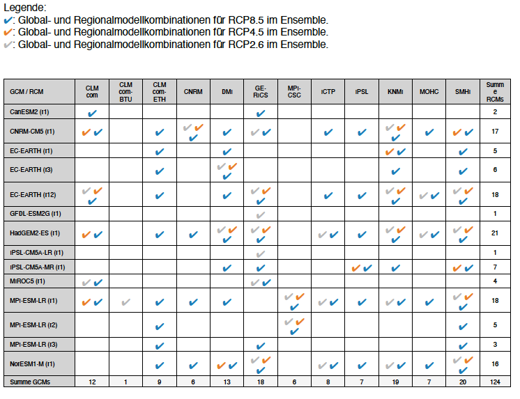

# Hintergrundinformationen Global- und Regionalmodellkombinationen der verwendeten Simulationen

In den vorliegenden Klima‑Check‑Karten werden für jedes Szenario alle zur Zeit im ESGF-Datenarchiv verfügbaren, auf CMIP5-Globalmodellsimulationen basierenden EURO-CORDEX-Simulationen gezeigt. Damit ist einerseits die maximale bekannte Bandbreite der Änderungen dargestellt. Andererseits erlaubt die Darstellung aller verfügbaren Simulationen eine Einordnung der Ergebnisse kleinerer Sub-Ensembles in die Gesamtheit der verfügbaren Simulationen.

Es handelt sich trotz der großen Anzahl von Simulationen um ein sogenanntes „Ensemble of opportunity“. Das bedeutet, dass die Bandbreite der möglichen Änderungen unter Umständen vom vorliegenden Ensemble nicht komplett erfasst wird. Außerdem sind die Ergebnisse für die drei Szenarien untereinander nicht vollständig vergleichbar, da die drei Ensembles aus unterschiedlich vielen Modellsimulationen mit zum Teil unterschiedlichen Modellen bestehen.

