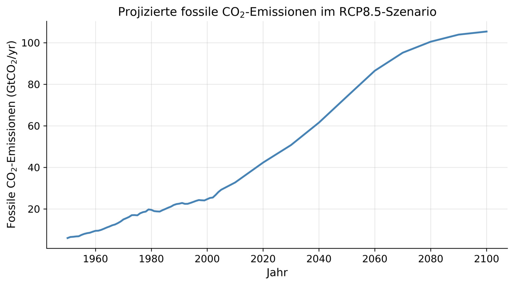

# Klimaprojektionen und Szenarien 

<small>*Quelle: http://www.pik-potsdam.de/~mmalte/rcps/index.htm#Download</small>

Mit Klimamodellen können Projektionen für das zukünftige Klima berechnet werden. Diese liefern Antworten auf die Frage: „Was wäre, wenn?“ Verschiedene Annahmen, z. B. zur Bevölkerungsentwicklung, der Energiegewinnung und -nutzung, dem technologischen Fortschritt oder der Wirtschaftsleistung, führen zu verschiedenen Entwicklungspfaden von Emissionen und Konzentrationen an Treibhausgasen. Solche Szenarien sind keine Vorhersagen, sondern beschreiben verschiedene plausible Entwicklungen. Mit Klimamodellen werden dann die Auswirkungen der Emissionen und der damit verbundenen veränderten Zusammensetzung der Atmosphäre auf das Klimasystem der Erde simuliert.

Im Rahmen des fünften [IPCC-Sachstandsberichts](https://www.de-ipcc.de/250.php/) wurden die „Representative Concentration Pathways“ (RCPs) als Szenarien verwendet, sie beginnen im Jahr 2006. Den Zeitraum davor beschreiben wir als historischen Zeitraum mit beobachteten Treibhausgaskonzentrationen. 

Im Rahmen von HaLaGa wird das Szenario RCP8.5 betrachtet. Dieses Szenario beschreibt einen anhaltenden Anstieg der Treibhausgasemissionen im Verlauf des 21. Jahrhunderts mit einer Stabilisierung auf einem sehr hohen Niveau gegen Ende des Jahrhunderts.

<small>**Van Vuuren, D. P., et al. (2026). The Scenario Model Intercomparison Project for CMIP7. Geoscientific Model Development, 19, 2627–2656. DOI: 10.5194/gmd-19-2627-2026.</small>