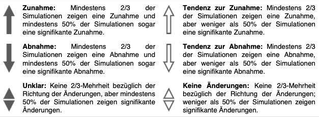

# Symbole der Experteneinschätzung zur Belastbarkeit der Projektionen

Klimatische Unterschiede von einer Zeitperiode zur nächsten sind durch zwei Ursachen geprägt:

1. Natürliche Schwankungen von Jahr zu Jahr. Da das Wetter ständigen chaotischen Schwankungen unterliegt, sind auch Klimagrößen über verschiedene Zeiträume nie identisch, auch ohne Klimawandel.

2. Der langfristige, systematische Einfluss externer Faktoren, z.B. der Ausstoß von Treibhausgasen. Um statistisch zu bewerten, ob Unterschiede einer Klimagröße eine solche systematische Ursache haben oder mit kurzfristigen, zufälligen Schwankungen erklärbar sind, wird für jede Simulation die statistische Signifikanz berechnet. Wir definieren eine Klimaänderung als signifikant, wenn sie gemäß des Mann-Whitney-U-Tests mit einer Wahrscheinlichkeit von unter 5% mit zufälligen Schwankungen erklärbar ist. Farblich ausgefüllte Pfeile bedeuten, dass mehr als 50% der Simulationen eine signifikante Änderung in die angegebene Richtung zeigen (Zunahme oder Abnahme)*.

<small>*Pfeifer, S., Bülow, K., Gobiet, A., Hänsler, A., Mudelsee, M., Otto, J., Rechid, D., Teichmann, C., & Jacob, D. (2015). Robustness of ensemble climate projections analyzed with climate signal maps: Seasonal and extreme precipitation for Germany. Atmosphere, 6(5), 677–698. https://doi.org/10.3390/atmos6050677.<small>