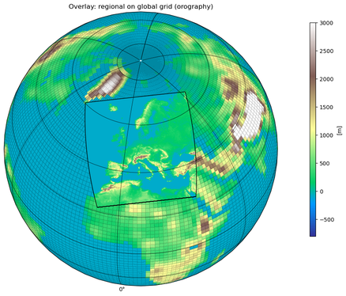

# EURO-CORDEX Datensatz

## Beschreibung

Die [EURO-CORDEX-Initiative](https://www.euro-cordex.net) und gehört zu der internationalen Initiative [CORDEX](https://cordex.org), die vom Weltklimaforschungsprogramm (World Climate Research Programme, WCRP) unterstützt wird.

Jede regionale Klimasimulation wird von einer [Globalmodellsimulation](Modelle.png) angetrieben. Die Globalmodellsimulationen wurden im Rahmen des „Coupled Model Intercomparison Project Phase 5 (CMIP5)" erstellt und bilden die Datengrundlage für die Klimaprojektionen [des 5. Sachstandberichts des Weltklimarats](https://www.de-ipcc.de/250.php/), der im Jahr 2013 erschienen ist. 

Das Ziel von EURO-CORDEX ist ein besseres Verständnis regionaler bzw. lokaler Prozesse, deren Variabilität und Änderung. Das EURO-CORDEX-Ensemble wurde evaluiert (Kotlarski et al., 2014; Vautard et al., 2013) und bildet die Datengrundlage von zahlreichen Publikationen über den zukünftigen Klimawandel in Europa (z.B. Jacob et al., 2014; Kjellström et al., 2018; Teichmann et al., 2018; Vautard et al., 2014)

## Szenarien
Weitere Informationen finden Sie unter folgendem [Link](Klimaszenarien.md)

## Räumliche Auflösung

Die Klima-Check-Karten basieren auf [EURO-CORDEX-Klimaprojektionen](Modelle.png)  mit einer horizontalen Auflösung von etwa 12,5 km (0,11°). Diese vergleichsweise hohe räumliche Auflösung ermöglicht eine detaillierte Darstellung regionaler Klimaänderungen und lokaler Besonderheiten in Hamburg.

<small>© dkrz.de</small>

## Literaturverzeichnis
<small>Jacob, D., Petersen, J., Eggert, B., Alias, A., Christensen, O. B., Bouwer, L. M., Braun, A., Colette, A., Déqué, M., Georgievski, G., Georgopoulou, E., Gobiet, A., Menut, L., Nikulin, G., Haensler, A., Hempelmann, N., Jones, C., Keuler, K., Kovats, S., Kröner, N., Kotlarski, S., Kriegsmann, A., Martin, E., van Meijgaard, E., Moseley, C., Pfeifer, S., Preuschmann, S., Radermacher, C., Radtke, K., Rechid, D., Rounsevell, M., Samuelsson, P., Somot, S., Soussana, J. F., Teichmann, C., Valentini, R., Vautard, R., Weber, B. and Yiou, P.: EURO-CORDEX: New high-resolution climate change projections for European impact research, Reg. Environ. Chang., 14(2), 563–578, doi:10.1007/s10113-013-0499-2, 2014.

Kjellström, E., Nikulin, G., Strandberg, G., Bøssing Christensen, O., Jacob, D., Keuler, K., Lenderink, G., Van Meijgaard, E., Schär, C., Somot, S., Lund Sørland, S., Teichmann, C. and Vautard, R.: European climate change at global mean temperature increases of 1.5 and 2 °C above pre-industrial conditions as simulated by the EURO-CORDEX regional climate models, Earth Syst. Dyn., 9(2), 459–478, doi:10.5194/esd-9-459-2018, 2018.

Kotlarski, S., Keuler, K., Christensen, O. B., Colette, A., Déqué, M., Gobiet, A., Goergen, K., Jacob, D., Lüthi, D., Van Meijgaard, E., Nikulin, G., Schär, C., Teichmann, C., Vautard, R., Warrach-Sagi, K. and Wulfmeyer, V.: Regional climate modeling on European scales: A joint standard evaluation of the EURO-CORDEX RCM ensemble, Geosci. Model Dev., 7(4), 1297–1333, doi:10.5194/gmd-7-1297-2014, 2014.

Teichmann, C., Bülow, K., Otto, J., Pfeifer, S., Rechid, D., Sieck, K., Jacob, D., Bülow, K., Otto, J., Pfeifer, S., Rechid, D. and Sieck, K.: Avoiding extremes: Benefits of staying below +1.5 °C compared to +2.0 °C and +3.0 °C global warming, Atmosphere (Basel)., 9(4), 1–19, doi:10.3390/atmos9040115, 2018.

Vautard, R., Gobiet, A., Jacob, D., Belda, M., Colette, A., Déqué, M., Fernández, J., García-Díez, M., Goergen, K., Güttler, I., Halenka, T., Karacostas, T., Katragkou, E., Keuler, K., Kotlarski, S., Mayer, S., van Meijgaard, E., Nikulin, G., Patarčić, M., Scinocca, J., Sobolowski, S., Suklitsch, M., Teichmann, C., Warrach-Sagi, K., Wulfmeyer, V. and Yiou, P.: The simulation of European heat waves from an ensemble of regional climate models within the EURO-CORDEX project, Clim. Dyn., 41(9–10), 2555–2575, doi:10.1007/s00382-013-1714-z, 2013.

Vautard, R., Gobiet, A., Sobolowski, S., Kjellström, E., Stegehuis, A., Watkiss, P., Mendlik, T., Landgren, O., Nikulin, G., Teichmann, C. and Jacob, D.: The European climate under a 2 °C global warming, Environ. Res. Lett., 9(3), 034006, doi:10.1088/1748-9326/9/3/034006, 2014.
</small>
