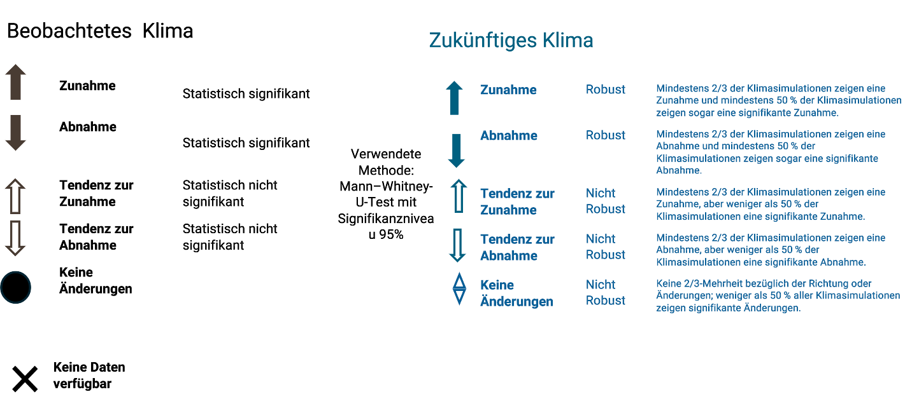

# Definition robuster Änderungen

## Aktuelles Klima:
Jede Änderung einer klimatischen Kennzahl (z.B. Tage mit Starkregen) wurde auf statistische Signifikanz getestet. Wir verwenden den Mann–Whitney-U-Test. Der U‑Test ist ein statistisches Verfahren, mit dem überprüft wird, ob Unterschiede zwischen zwei Zeiträumen verlässlich sind oder durch Zufall auftreten können. Wir verwenden ein 95 % Signifikanzniveau. Das bedeutet, dass bei statistischer Signifikanz die Ergebnisse mit hoher Sicherheit nicht zufällig sind. Die Wahrscheinlichkeit, dass die Unterschiede rein zufällig auftreten, liegt bei höchstens 5 %.​

## Zukünftiges Klima:
Für die zukünftige Entwicklung des Klimas verwenden wir Ergebnisse aus Klimamodellen. Solche Modelle enthalten immer Unsicherheiten. Um die Belastbarkeit der Ergebnisse zu erfassen, betrachten wir deshalb viele verschiedene Klimasimulationen. Für das Szenario mit sehr hohen Emissionen im Klimasystem wurden insgesamt 50 regionale Klimasimulationen ausgewertet. Ordnet man die Ergebnisse für eine klimatische Kennzahl (z. B. Tage mit Starkregen) der Größe nach, verwenden wir den Wert, der genau in der Mitte liegt.​

Zusätzlich geben wir den Bereich an, in dem sich die meisten Ergebnisse (70%) um die Mitte herum befinden. Jede klimatische Kennzahl wird außerdem durch eine Experteneinschätzung zur Aussagekraft ergänzt (siehe Erläuterung der Symbole).​

## Symbole robuster Änderungen

